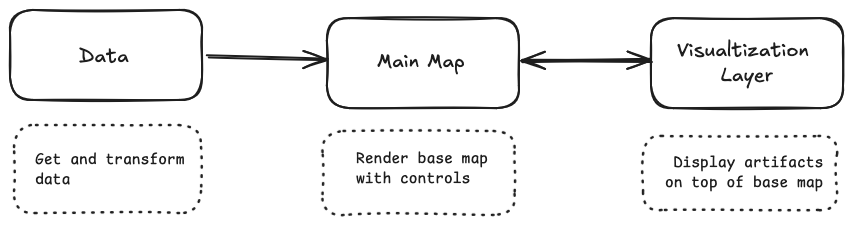

# Template Dev Notes

This is a template for custom interfaces.
It has mainly three major components.

1.  Data
2.  Main Map
3.  Visualization Layer

# Data :

Data component is mainly for getting data from api and transforming it according to the
use case of the interface.

# Main map:

This component is to provide a context of mapbox to render the geomap.
All the visualizations of the assets and artifacts are done on top of this map.
The controls or the map liek zoom, home, measurement feature are all defined and
controlled from here.

# Visualization Layer:

The assets and artifacts to be displayed are composed and rendered using this component.
Markers, polygon on top of the map and the raster inside the polygon are part of this
component.
Also the information box to show information of the artifacts are also handled here.

# Use:

While trying to port any custom-interfaces using this template, you have to change the Data
and Visualization component.
API for getting data, methods for transforming data are some areas you need to work on before
ingesting it to the Map

Also the Visualization layer is the main component to display items on top of the map.
Markers to show the location, polygons to show the area or any artifacts and the raster
image showing the details of the asset, animation of the items, information box etc are to be
changed accordingly.
